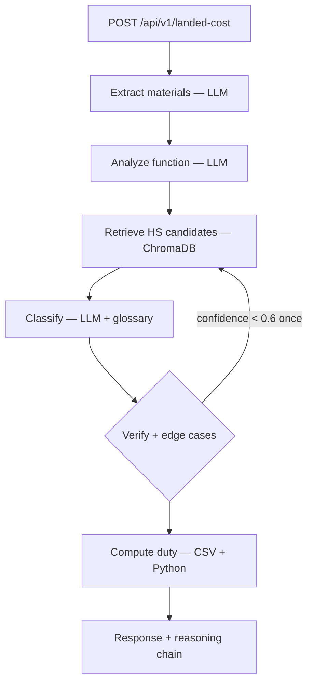

# Landed

**Landed** is a single API that takes an Indian product description, INR price, and destination country, then returns an indicative **landed cost** — HS classification reasoning, import duty, VAT/GST-style tax, and FTA savings — with a **full reasoning chain** at every step.

Cross-border buyers abandon carts when costs are unclear ([Baymard, 2025](https://baymard.com/); [Avalara, 2024](https://www.avalara.com)). Indian D2C brands need **DDP-style transparency** without marketplace-sized take rates. Landed uses a **LangGraph** pipeline (not a one-shot RAG answer) to reason about materials, function, retrieval, classification, verification, and deterministic duty math.

## Architecture



- **Embeddings:** `sentence-transformers/all-MiniLM-L6-v2`
- **LLM:** Ollama + Mistral 7B Instruct (local) **or** Groq free tier (Llama 3.1 8B Instant) via `LLM_PROVIDER`
- **Duty / FTA:** static CSV + JSON under `data/`

## Quick start

```bash
cd landed
python3 -m venv .venv && source .venv/bin/activate   # 3.9+ required; 3.11+ recommended
pip install -e ".[dev]"
cp .env.example .env
# Local LLM: install Ollama, then `ollama pull mistral` (default OLLAMA_MODEL=mistral). Or use Groq: GROQ_API_KEY + LLM_PROVIDER=groq
python scripts/build_vector_store.py
uvicorn src.main:app --reload --host 127.0.0.1 --port 8000
```

- **API docs:** http://localhost:8000/docs  
- **Demo UI:** http://localhost:8000/demo  

### Share the demo with a friend (LAN or public URL)

`127.0.0.1` only works on **your** machine. The demo calls the API on **whatever host served the page**, so friends can use it if they open **your** machine’s address or a **tunnel**.

**Same Wi‑Fi (LAN)**

1. Start the server on all interfaces:

   ```bash
   uvicorn src.main:app --reload --host 0.0.0.0 --port 8000
   ```

2. Find your computer’s LAN IP (e.g. macOS: **System Settings → Network**, or run `ipconfig getifaddr en0` in Terminal).

3. On your phone or your friend’s laptop (same network), open:

   `http://YOUR_LAN_IP:8000/demo/`

   Allow the port in your OS firewall if nothing loads.

**Different house / different Wi‑Fi (WhatsApp, etc.)**

Your LAN IP only works on **your** network. For a friend at home, use a **tunnel** that gives a public `https://…` URL to your laptop.

**Option A — ngrok (easy to paste in WhatsApp)**

1. Install from [ngrok.com/download](https://ngrok.com/download) and add your free authtoken once ([dashboard](https://dashboard.ngrok.com/)).
2. Run Landed: `uvicorn src.main:app --reload --port 8000`
3. In another terminal: `ngrok http 8000`
4. Copy the **https** URL (e.g. `https://abc123.ngrok-free.app`).
5. WhatsApp your friend: **`https://abc123.ngrok-free.app/demo/`** (include **`/demo/`**).

Keep your computer **on** and **ngrok running** while they use it.

**Option B — Cloudflare Quick Tunnel**

Install [cloudflared](https://developers.cloudflare.com/cloudflare-one/connections/connect-networks/downloads/), then:

```bash
cloudflared tunnel --url http://localhost:8000
```

Send the printed `https://….trycloudflare.com` link with **`/demo/`** on the end.

**Security:** The link exposes your local API (and LLM usage). Stop ngrok/cloudflared when done; don’t post the link in public channels.

### Troubleshooting (Ollama `404` / model not found)

Your `.env` may still point at an old tag (e.g. `mistral:7b-instruct-v0.3-q4_K_M`). Either run the exact `ollama pull …` for that tag, or set `OLLAMA_MODEL=mistral` after `ollama pull mistral`, then restart uvicorn.

The JSON response includes **`simple_explanation`**: a short, plain-English version of why the product landed in that duty category (generated during verification). **`classification_reasoning`** remains the more technical line for specialists.

## API example

```bash
curl -s -X POST http://localhost:8000/api/v1/landed-cost \
  -H 'Content-Type: application/json' \
  -d '{
    "product_title": "Sterling Silver Kundan Earrings",
    "product_description": "Handcrafted earrings with kundan on 925 silver",
    "material": "Sterling silver 925",
    "weight_grams": 22,
    "price_inr": 4500,
    "destination_country": "AE"
  }' | jq .
```

## Accuracy

Run the **50-product eval** (with the API up): `python3 scripts/eval_accuracy.py` → results in **`docs/eval_results.json`**, dashboard at **`/eval`**.

**Give results to Claude (or any LLM) for commentary:**

```bash
python3 scripts/export_eval_for_claude.py
```

(No other flags needed. Optional: `-i` / `-o` for input/output paths. Extra mistaken flags are ignored with a note.)

Output: **`docs/eval_claude_brief.md`** — open it and paste into Claude; ask for failure patterns and concrete prompt/RAG changes.

Improving toward **~90% at HS4** usually means: better **retrieval** (corpus, chunking, chapter hints), **constrained** classification (pick only from retrieved codes), **few-shot** examples from your failures, **rules** for known traps (see eval fixture notes), optional **second verifier** node, and a **stronger model** on classify/verify only—not always “more agents.”

Draft JSON chapters are indicative — replace with counsel‑reviewed schedules for production.

## Production note (caching)

Responses are **on-demand**: for production, add **caching** keyed by normalized product text + destination + HS + duty version (embeddings and CSV snapshots) to cut latency and LLM cost. Honour privacy and counsel review before reliance at scale.

## What’s next

- Leg 2: post-purchase tracking and returns orchestration agents  
- Shopify widget, carrier comparison, and customs document bundles  
- Partner APIs for logistics enablers  

## Sources (problem framing)

| Claim | Source |
|------|--------|
| 48% abandonment from unexpected costs | Baymard Institute, 2025 |
| 58% surprise customs; 49% refusal; 75% reconsider | Avalara global surveys, 2024 |
| Indian brands / shipping context | eShipz and industry commentary (see spec) |

## License

Proprietary / project-specific — adjust as needed.
