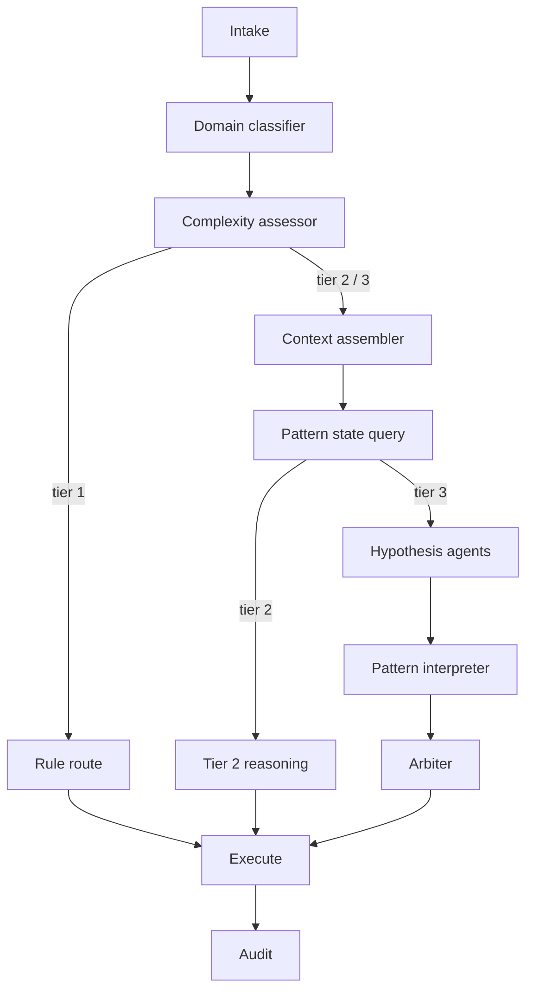

# ARIA — Agentic Routing & Intelligence for Amenities

**ARIA** is an agentic complaint routing system for facility management. It sits inside **Resolv** as the intelligence layer: it is not a generic ticketing product or CRM. It takes ambiguous resident complaints, reasons over spatial and historical context, and returns a routing decision with a full reasoning trace—so the right vendor is dispatched with the right priority, especially when mistakes are asymmetric (structural vs. plumbing, safety vs. convenience).

---

## Problem

In large residential and campus-style properties, complaints often arrive through portals or CRMs and then sit in manual queues. Typical failure modes:

- **Slow or silent acknowledgment** — residents do not know whether anyone saw the issue or when someone will arrive.
- **Wrong vendor first** — a misrouted visit wastes time, doubles turnaround, and compounds damage (e.g., structural seepage treated as a simple plumbing job).
- **No shared context** — vendors may arrive without flat history, adjacency/stack context, or building-wide patterns; first-visit resolution stays low.
- **Uniform accuracy is the wrong objective** — sending the wrong crew for a loose hinge is cheap; missing structural seepage or underestimating an electrical safety hazard is not.

ARIA is built around **asymmetric cost-of-error**: hypotheses that are expensive or dangerous if missed are weighted accordingly in the decision layer.

---

## Solution

ARIA processes each complaint through a **tiered pipeline**:

| Tier | Role | Typical share (design target) |
|------|------|-------------------------------|
| **1** | Deterministic rules — high-confidence patterns, no LLM | ~35% |
| **2** | Single reasoning pass — complaint + retrieved context → one routing decision | ~40% |
| **3** | **Parallel hypothesis agents** (isolated evidence per hypothesis), **pattern interpretation**, then an **arbiter** that integrates scores with cost-of-error weights | ~25% |

Why multiple agents instead of one big prompt? A single model judging several hypotheses in one shot tends to **anchor** on the first hypothesis. Isolated agents, each seeing only evidence relevant to one hypothesis, produce more independent assessments; the arbiter then combines them and can output **multi-action** plans (e.g., immediate plumber visit plus follow-up structural assessment when uncertainty and downside risk are both high).

Downstream product flows (fast acknowledgment, slot choice, masked vendor communication, resolution feedback) are described in `ARIA.md` as the **experience layer**; this repository focuses on the **routing and reasoning** core.

---

## Architecture

High-level flow (matches `src/pipeline/resolv_graph.py`; Tier 1 skips context and pattern query):



- **Pipeline nodes** (normalizer, classifier, assessor, context assembly, pattern query, execution stubs, audit) are deterministic or pure retrieval—no LLM unless specified.
- **Hypothesis library** and tier rules live in `src/config/` (`hypothesis_library.yaml`, `domain_rules.yaml`, `tier_rules.yaml`); prompts live under `src/agents/prompts/`.
- **Orchestration** is implemented with **LangGraph** (`src/pipeline/resolv_graph.py`).

For more detail, see `ARIA.md` (product and agent map) and `ARCHITECTURE.md` (implementation-oriented breakdown).

---

## Quick start

**Prerequisites:** Python 3.11+, PostgreSQL (database name `resolv` matches defaults in `src/api/main.py`), Redis (for pattern state; default `redis://localhost:6379`), and an **Anthropic API key** for LLM calls.

From the repository root:

```bash
python3 -m venv .venv && source .venv/bin/activate
pip install anthropic asyncpg fastapi langgraph numpy psycopg2-binary pydantic pyyaml redis scikit-learn uvicorn
export ANTHROPIC_API_KEY=your_key_here
# Create DB and schema — see scripts/create_schema.sql and PHASE1_BUILD.md
uvicorn src.api.main:app --reload --host 127.0.0.1 --port 8000
```

- **Interactive API docs:** http://127.0.0.1:8000/docs  
- **Health:** `GET /health`

Load historical complaints and adjacency data using the scripts in `scripts/` when you are running evaluations or context-rich routes (`PHASE1_BUILD.md`).

---

## API example

Submit a complaint and receive tier, domain, actions, SLA hints, and a reasoning string:

```bash
curl -s -X POST http://127.0.0.1:8000/complaints \
  -H 'Content-Type: application/json' \
  -d '{
    "complaint_title": "Water dripping from ceiling in kitchen",
    "site_name": "Example Site",
    "tower": "T6",
    "flat": "T6-1203"
  }' | jq .
```

Optional fields: `ticket_id`, `priority_requested`.

Other useful endpoints: `GET /complaints/{ticket_id}` (audit trace placeholder in Phase 1), `GET /complaints/stats`, `GET /clusters/active` (query params: `site_name`, `tower`, optional `domain`).

---

## Eval

The evaluation harness drives real (or sampled) rows through `process_complaint` and writes CSV results under `eval/results/`:

```bash
# Smoke — small sample, all tiers
python3 eval/run_evaluation.py --sample 10 --tiers 1,2,3

# Larger sample — check API cost notes inside the script before scaling up
python3 eval/run_evaluation.py --sample 100
```

See the docstring in `eval/run_evaluation.py` for **cost estimates** and `--full` behavior. Tier mix and token usage are aligned with the blended cost discussion in `ARIA.md`.

---

## Tech stack

| Layer | Choices |
|--------|---------|
| API | FastAPI, Uvicorn, Pydantic |
| Orchestration | LangGraph |
| LLMs | Anthropic (Haiku / Sonnet / Opus — roles per `ARIA.md` and pipeline code) |
| Data | PostgreSQL (`psycopg2`, `asyncpg` in context assembly), optional Excel ETL via `scripts/load_complaints_xlsx.py` |
| Pattern memory | Redis + NumPy + scikit-learn (DBSCAN) for sliding-window clusters |
| Config | YAML — domains, tiers, hypothesis definitions |

---

## License

Proprietary / project-specific — adjust as needed.
